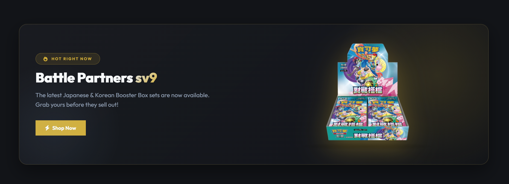
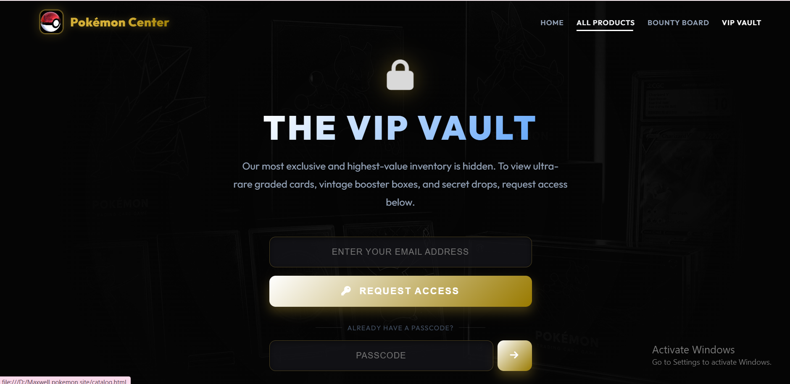
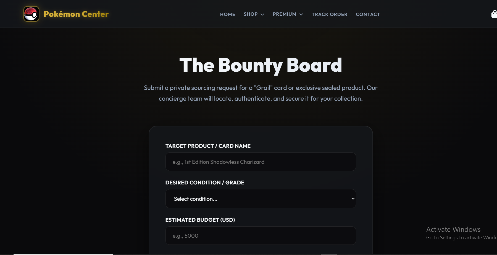
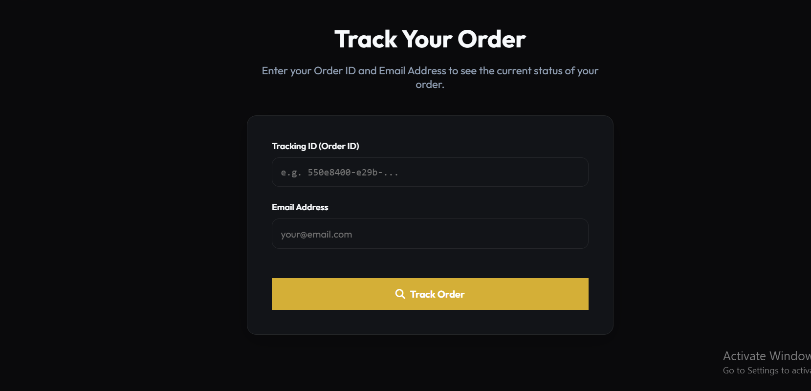
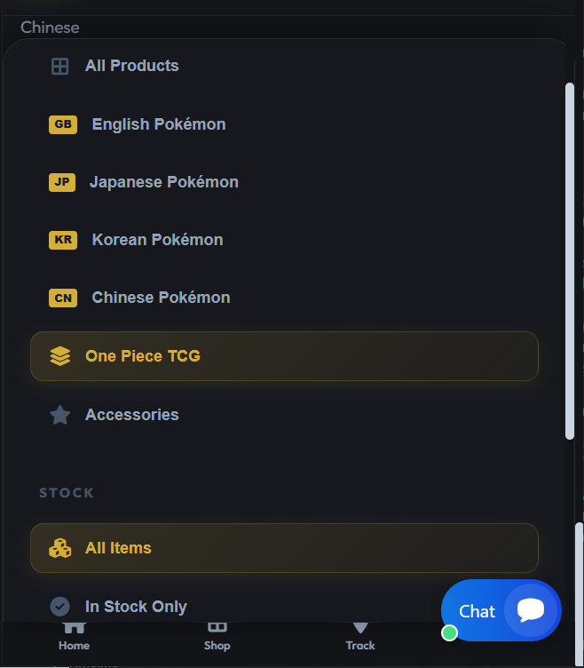

hey please there are some things we have to work on please.............
1)  please help me redeign these, it should have a different structure and please it should be very sleek and proffesional please. and after that, please make sure in the admin dasgnoard if the admin edits a product and in features he clicks yes on the procut, the product should be the one to appear where that product is in the image ( since you will redisgn the product should be perfectly apear with good animations and sleek design) 
2)  this is what i want here, please when the cleint puts his/her email and tap the request access, it should appear in the admin dashboard to either grant the request or reject and if you grant it a secret code shout automatically be created and an email should be sent to the cleint telling him/her request accepted and the code should be attached and when the cleint inputs the code there it takes him/her to the VIP vault page, where in the admin dashboard the admin is the one uploading the images and the rest. please make sure the admin dashboard is connected to the front site of the website please.
3)  now pease here when cleint comes here and wants a bounty board (study this my system well an you will understand) when the cleint fills in all the information and submit a message ( well animated) the massage should state something as such, that the admins will look into it and get back to him vai email...
4)  please make sure this works, when the cleints has added what he wants to cart and goes to cart and fill in his informations and click check out a message should shown to him, with the tracking code he can copy and paste to track and he/she will see all the updates on his order.
5) please for all the email set up stuff, please use this token from bravo: [REDACTED]    please use it 
6) when i have added to cart and i go and fill all does information and i try to place order it is showing me failed to place order, please make sure it works please.
7)  please study the catalog page and adjust it for me perfectly please. in the catalog page when you click let say japaness pokemon cart for it to filder you will have to scroll down to see it which i do not like please make that when you click it, it either opens so you see the products so you do not have to scroll, espatailly on mobile devices please. make it very proffesonal please 
